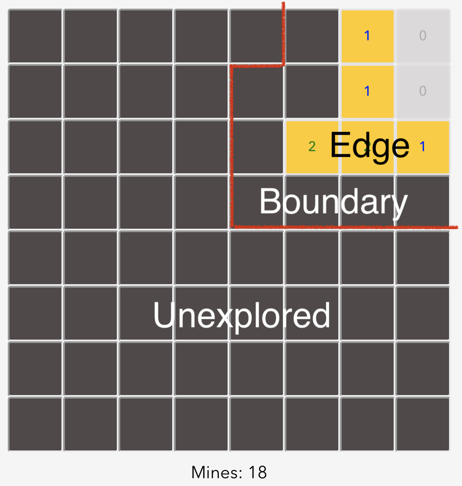
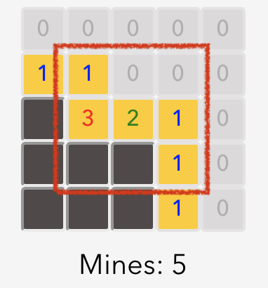
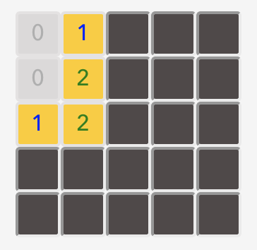
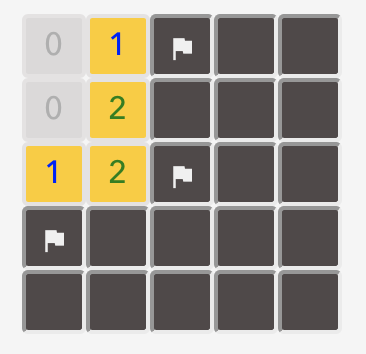
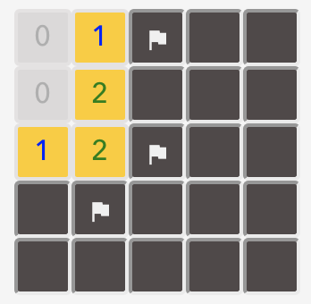
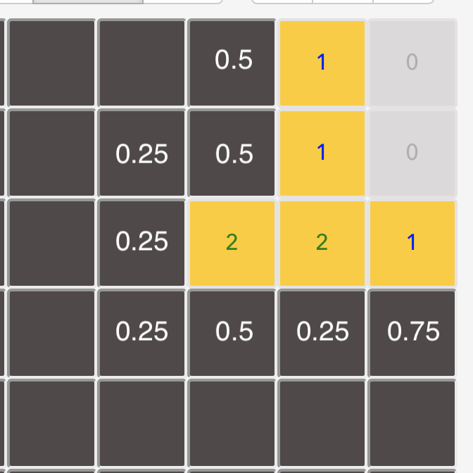
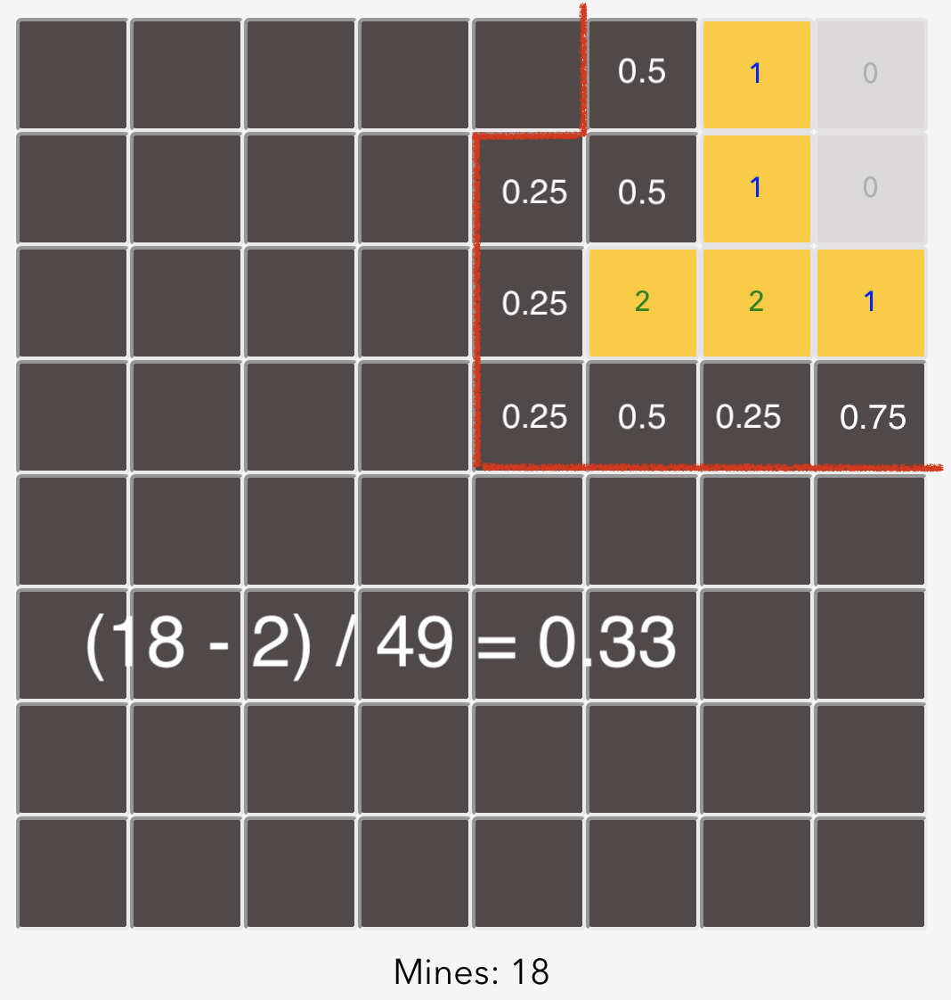
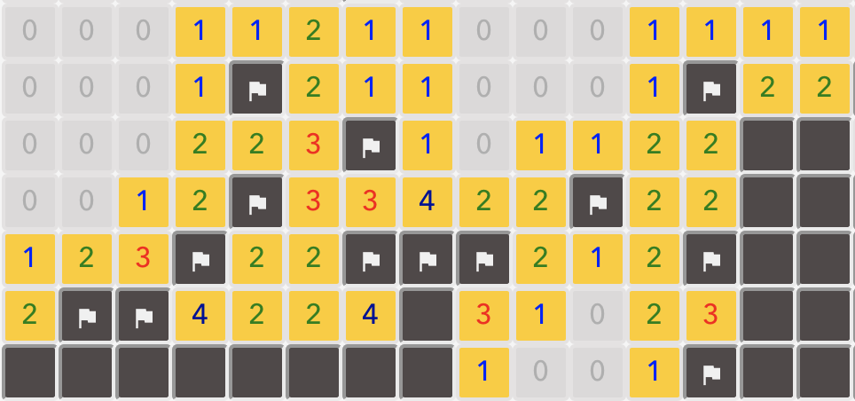
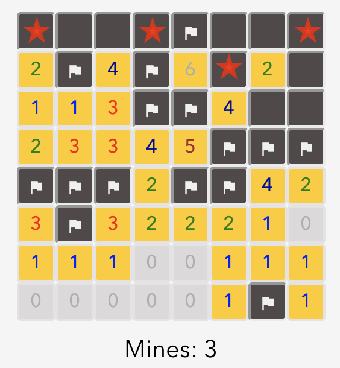

# Description

This is a classic [Minesweeper](https://en.wikipedia.org/wiki/Minesweeper_(video_game)) game with an AI agent. You can turn on AI agent mode any time in game, it will read the game board information and automatically solve it with smart game strategies. There are three different difficulty modes you can choose:

- Easy: 8 by 8 tiles with 10 mines, AI agent can solve it with 87.4% success rate.

- Medium: 16 by 16 tiles with 40 mines, AI agent can solve it with 84.7% success rate.

- Hard: 16 by 30 tiles with 99 mines, AI agent can solve it with 43.1 success rate.

The success rates are tested by 1000 random game boards in each difficulty. All the project are coded in [React JS](https://reactjs.org/), you can check out the source code [here](https://github.com/whereitisvc/minesweeper-reactjs).

# How it works

There are mainly four strategies applied adaptively by AI agent. That means the more complex one will be applied only if the easier one fails (no move return). Before we start demonstrating those strategies, we first define the terms will be used in this article:

Edge tiles are those uncovered tiles on the edge of our explored area. They provide the major information for solving puzzles. Boundary tiles are the covered tiles that immediately contact with edge tiles. They are the major candidates for the next move. Unexplored tiles are the rest of the covered tiles.

### Stage 1: Uncover the neighbor of zero tiles

Zero tiles are the covered tiles which show there are no mines surround them. We can use [Depth First Search (DFS)](https://en.wikipedia.org/wiki/Depth-first_search) to uncover them recursively. It will be automatically applied when you are playing manually.

### Stage 2: Uncover/Flag the tiles by deduction 

Here we check all the edge tiles surrounding to see if any boundary tile is or is not mines for sure. For example: 

We can deduce the two boundary tiles are mines because there are two mines in the red square and they are the only two covered tiles.

### Stage 3: Calculate all the configurations

Here, no easy tile can get. People who are new to Minesweeper might get stuck and try to uncover a tile randomly. However, by more deeper deduction, we may get some confident moves in chance. For example:  

We can't get any answer by looking at only one edge tile. But when looking all the edge tiles together, we find out there are only two possible configurations:

​							 

In both possible configurations, the right four boundary tiles are the same, meaning that these tiles can be uncovered/flagged for sure. Therefore, at this stage, our mission is to find out all the possible configurations of the boundary tiles. AI agent uses DFS with [Backtracking](https://en.wikipedia.org/wiki/Backtracking) to accomplish this task.

### Stage 4: Make the best guess by probability 

At this stage, all the possible configurations have found but no boundary tile is safe. We have no choice but to make a guess. Fortunately, the configurations we found can help us to make a smart guess. By stating all the possible mine occurrence, we can get the mines occurrence probability  of each boundary tile. Then, uncover the boundary tile with the smallest probability can give us the biggest chance to go further. For example:

We will choose one of the four boundary tiles with 0.25 probability to uncover instead of from all eight boundary tiles. 

Sometimes, uncover the unexplored tile is worth to try, especially when you are in the early game. With this viewpoint, we compare the probability in the boundary area and in the unexplored area before we make our final guess. If the probability of the unexplored area is smaller, than we uncover a random unexplored tile. Note that when calculating the mine occurrence probability of unexplored area, we need to know the smallest possible number of mines in boundary area (which can be attained from calculating configurations in stage 3) because we don't want to underestimate the probability in the unexplored area. Take the above board as an example, the smallest possible number of mines in the boundary area is two, hence, the probability in the unexplored area is (18 - 2) / 49 = 0.33:

Where 18 is the remain mines in game and 49 is the number of unexplored tiles. In this case, AI agent still uncovers the boundary tile because 0.25 is smaller, but if there are more unexplored tiles (probability decrease) it may turn to randomly uncover one of the unexplored tiles. Note that if the probability of unexplored area equals to 1.00 doesn't mean all unexplored are mines for sure because we calculate the probability pessimistically (as high as possible). On the other hand, if the probability is equal to 0, then we can sure all unexplored tiles are safe. 

### Segmentation

When the game board becomes bigger, there might have several boundary areas which are independent. For example:

We can see that whatever the configuration in the left boundary area will not affect the right boundary area. If we treat them as one area, the DFS tree for finding possible configurations becomes extremely inefficient. Moreover, the probability we calculated will become imprecise. Therefore, it is important to do the boundary area segmentation (AI agent run DFS on edge tiles, so actually is doing edge tiles area segmentation) before calculating possible configurations. AI agent uses [Union Find](https://en.wikipedia.org/wiki/Disjoint-set_data_structure) to accomplish this task.

### Closing to the game end

Finally, there is one more strategy that can increase our guessing quality, especially when closing to the end of the game. If there are no unexplored tile anymore, we can reject the possible configurations which set up less number of mine than the game remaining mines because all the mines are in the boundary area. For example:

The red stars are the mines in one of the possible configurations. However, only three mines left in the game, we can then reject this possible configuration.

# Conclusion & Credits

The strategies applied in this project are majorly credited to this article: *["How to Write your own Minesweeper AI"](https://luckytoilet.wordpress.com/2012/12/23/2125/)* . Please check it out if you are interested in more details. There are also lots of other Minesweeper solving strategies worth to try. For example, *["Solving Minesweeper with Matrices"](https://massaioli.wordpress.com/2013/01/12/solving-minesweeper-with-matricies/comment-page-1/)* uses matrices to represent the information of the edge tiles and boundary tiles and therefore can find out the possible configurations by reducing the equations. This method can significantly improve the efficiency in contrast to DFS. Nevertheless, when comparing to the success rate, I believe this project demonstrates a decent result. Finally, the source code of the project is available on Github. Please feel free to check it out.

